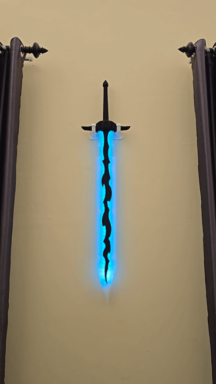

# Solo Leveling: Demon King Sword (Code by erate)

This repository contains the source code for the LED effects used in the Solo Leveling Demon King Sword.

## 🔗 Credit & Original Design
The 3D design and original concept are **not mine**. All credit for the incredible 3D model goes to **makersark3d** on MakerWorld:
- **Owner Profile:** [MakerWorld @makersark3d](https://makerworld.com/en/@makersark3d)
- **The Project:** [MakerWorld - Demon Monarch Sword](https://makerworld.com/en/models/1389751)

You can also check my boring profile here:
- **My Profile:** [MakerWorld @erate](https://makerworld.com/en/@erate/)

## 🛠️ Purpose of this Repo
The original project was designed for the ESP32-C3. I created this repository to share the code I used for my build, which utilizes the **Seeed Studio XIAO ESP32-C6** (I only have this module at that time LOL). I am hosting it here to make it easier for the MakerWorld community to access the code for this specific hardware configuration.

## ⚡ Project Overview
This code creates a dynamic "Blue Lightning" effect inspired by Solo Leveling. I have specifically optimized this version for the **Seeed Studio XIAO ESP32-C6**.

### Key Features:
- **FastLED Integration:** Smooth blending between base, flash, and halo colors.
- **Power Optimized:** Brightness is set to `191` (75%) to prevent excessive drain on the dual 402030 battery setup.
- **Hardware:** Designed for the XIAO ESP32-C6 (GPIO 1 for LED Data).

## 🛠️ Hardware Setup
- **Microcontroller:** Seeed Studio XIAO ESP32-C6.
- **LED Strip:** 60x WS2812B LEDs.
- **Power:** 2x 402030 Li-Po batteries in parallel.
- **Switch:** I use a small Slide Switch between the Battery (+) and the board battery charging (+) to manually disconnect the battery from charging/discharging.
- **Important:** Ensure the LED Strip GND and ESP32 GND are connected (Common Ground).

## 🚀 Installation
1. Install the `FastLED` library in your Arduino IDE.
2. Install the ESP32 board package via the Boards Manager.
3. Connect your LED strip to **D1 (GPIO 1)**.
4. Upload `Solo_Leveling_Demon_King_Sword.ino` to your board.
